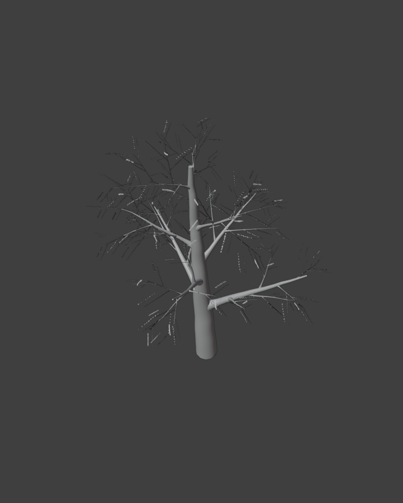
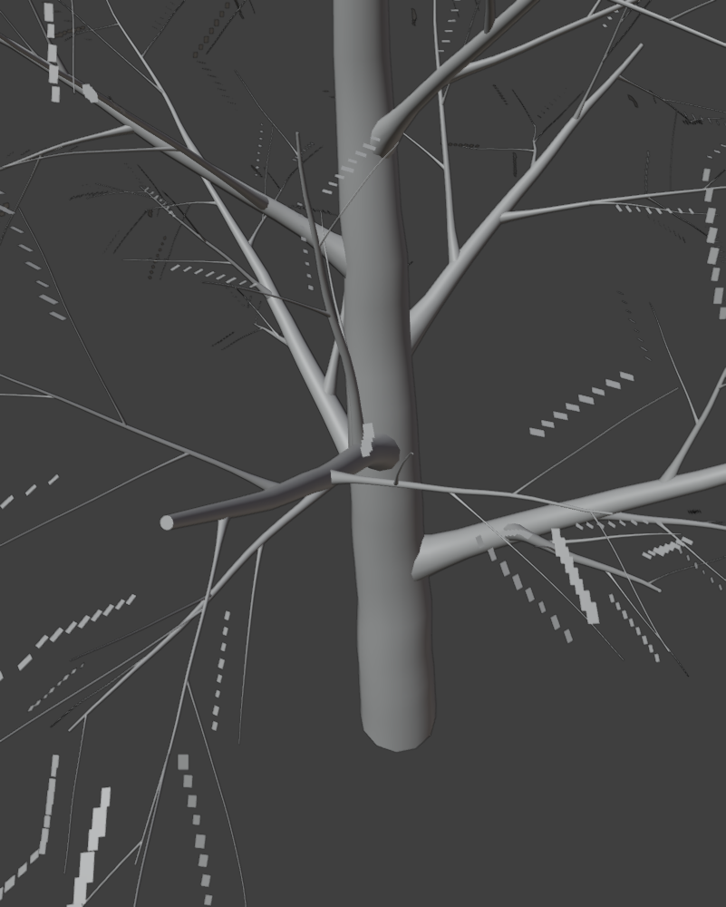

# Procedural Tree & Foliage Suite for Blender 4.2+ LTS & 5.x

[](https://www.blender.org/)
[](https://www.gnu.org/licenses/gpl-3.0)

A comprehensive, modular procedural tree and foliage generation suite for **Blender 4.2+ LTS and Blender 5.x**. Built with a hybrid Python (`bpy`) operator architecture and a procedural **Geometry Nodes** execution engine. Replicates and expands upon the core procedural concepts of Houdini's *Simple Tree Tools 3.0*.

---

## Visual Showcase

| Full Procedural Tree Hierarchy | Organic Branch Collar Joint Flare |
|:---:|:---:|
|  |  |

---

## Key Features

### 1. Parametric Trunk & Spline Foundation
* Spline-based curve primitive foundation with parametric height and resampling resolution.
* Non-destructive 4D Simplex/Perlin noise displacement anchored at the trunk root.
* Flexible taper falloff curves and profile controls.
* Optional **Guide Curve** influence for custom art-directed trunk shapes.

### 2. Biological Tropisms & Environmental Growth Engine
* **Gravitropism:** Gravity/droop or anti-gravity growth vectors scaled by spline parameter length, producing natural weeping or upright branches.
* **Phototropism:** Directional vector pulling branch tips toward a designated Sun Object or coordinate vector.
* **Thigmotropism / Obstacle Avoidance:** Geometry proximity and raycast detection against user-specified collision objects to steer branches away from barriers.

### 3. Hierarchical Recursive Branching with Da Vinci Diameter Scaling
* Multi-tier recursive branching: **Trunk $\to$ Primary (Tier 1) $\to$ Secondary (Tier 2) $\to$ Twigs (Tier 3)**.
* **Golden Angle Phyllotaxis:** $137.5^\circ$ spiral distribution along parent curve tangents.
* **Da Vinci's Pipe Model Area Rule:** Base diameter and branch length automatically scale along the parent curve:
  * Lower branches are thicker and longer.
  * Upper branches progressively become thinner and shorter.
  * Child branches strictly sample their parent's evaluated local radius at the junction point, ensuring child branches are always thinner than their parent.
* **Smooth Organic Joint Collar Flare:** Continuous quadratic flare over the first 22% of branch length smoothly merges branches into the trunk with realistic biological collars.

### 4. Scan Extension Module (Photogrammetry Blending)
* Select a photogrammetry 3D trunk scan mesh and boundary curve.
* Raycast point scattering on scan topology to spawn organic procedural branches aligned to vertex normals.
* Seamless organic union via voxel remeshing.

### 5. Leaves & Foliage Instancing
* Support for procedural diamond leaves, card cutouts, and custom user leaf mesh objects.
* Normal alignment with pitch, roll, and sun-facing rotation controls.
* Density masking along twig spline factors.

### 6. Wind & Secondary Motion
* Procedural 4D noise deformation driven by `#frame` / scene time.
* Wind strength masking modulated by curve parameter factor (roots anchored, tips dynamic).

### 7. Real-Time Pipeline & Pivot Painter 2.0 Export
* Built-in baking operator computing branch hierarchy indices (`pp_tier`), local wind weights (`pp_wind_weight`), and parent pivot vectors (`pp_parent_pivot`).
* Bakes attributes into standard Color Attributes and UV channels compatible with Unreal Engine and Unity foliage shaders.
* One-click FBX exporter preserving custom mesh attributes.

---

## Botanical Presets

The addon comes bundled with pre-configured botanical archetypes:
1. **Oak (Deciduous):** Spreading canopy with gnarly secondary branches, wide scaffold boughs, and prominent flared collars.
2. **Pine (Conifer):** Tall conical trunk with horizontal drooping branch tiers and high length falloff.
3. **Birch (Slender):** Slender upright trunk with steep delicate branches and high-frequency noise.
4. **Weeping Willow:** Cascading curtain-like branches with hanging tips governed by strong positive gravitropism.
5. **Stylized / Bonsai:** Artistic gnarly curves with stylized foliage clusters.

---

## Installation

1. Download the [`tree_tools_addon.zip`](tree_tools_addon.zip) archive or clone this repository.
2. In Blender:
   - Go to **Edit $\to$ Preferences $\to$ Add-ons**.
   - Click the header arrow $\to$ **Install from Disk...** (or **Install...**).
   - Select `tree_tools_addon.zip` and enable the addon.
3. Open the **3D Viewport**, press **`N`** to reveal the sidebar, and switch to the **Tree Tools** tab.
4. Select a preset and click **Create Procedural Tree**.

---

## Addon Architecture

```text
tree_tools_addon/
├── __init__.py          # Addon registration, bl_info metadata, extension manifest
├── blender_manifest.toml# Blender 4.2+ Extension platform manifest
├── operators.py         # Operators: create tree, apply preset, bake Pivot Painter, export FBX
├── ui.py                # 3D Viewport N-Panel with parameter categories and real-time sliders
├── nodes_builder.py     # Programmatic Geometry Node tree generator (Trunk, Tropisms, Tiers, Foliage)
└── utils.py             # Math utilities, botanical preset definitions, and material generators
```

---

## License

This project is licensed under the GNU General Public License v3.0 (GPL-3.0). See [LICENSE](LICENSE) for details.
